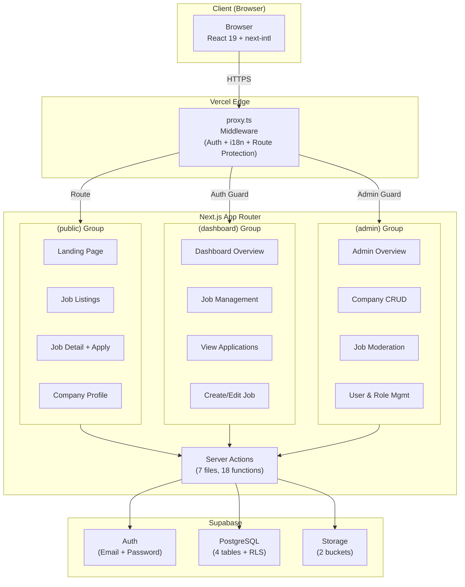
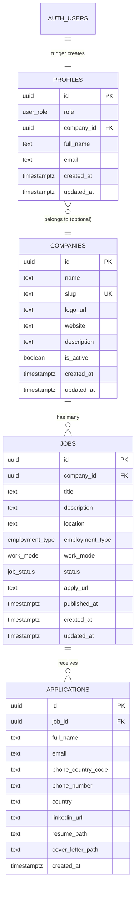
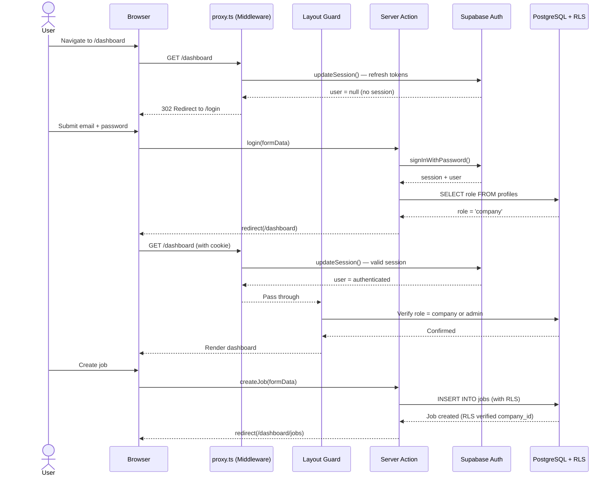
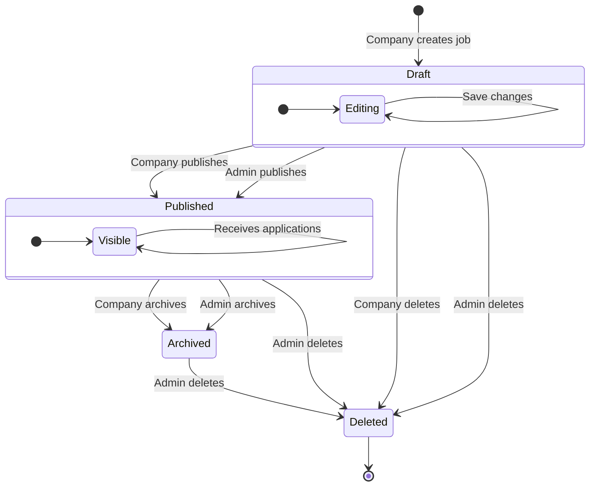
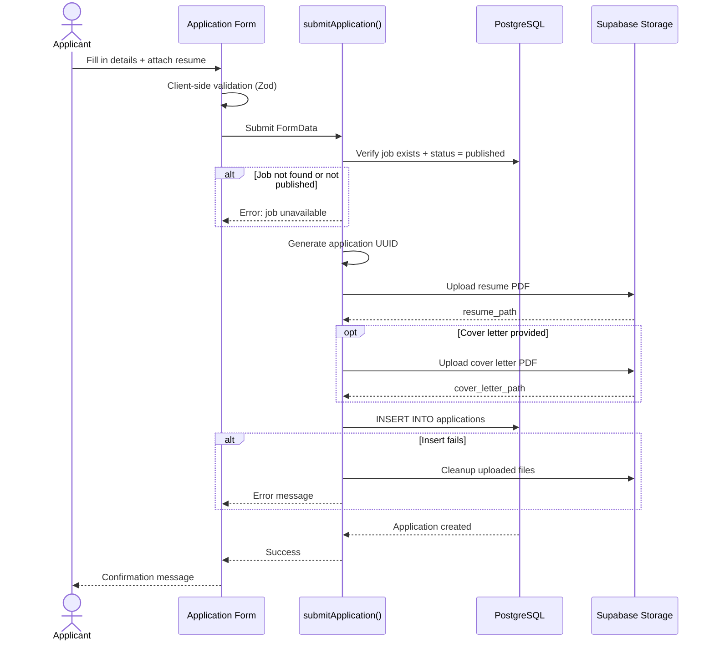
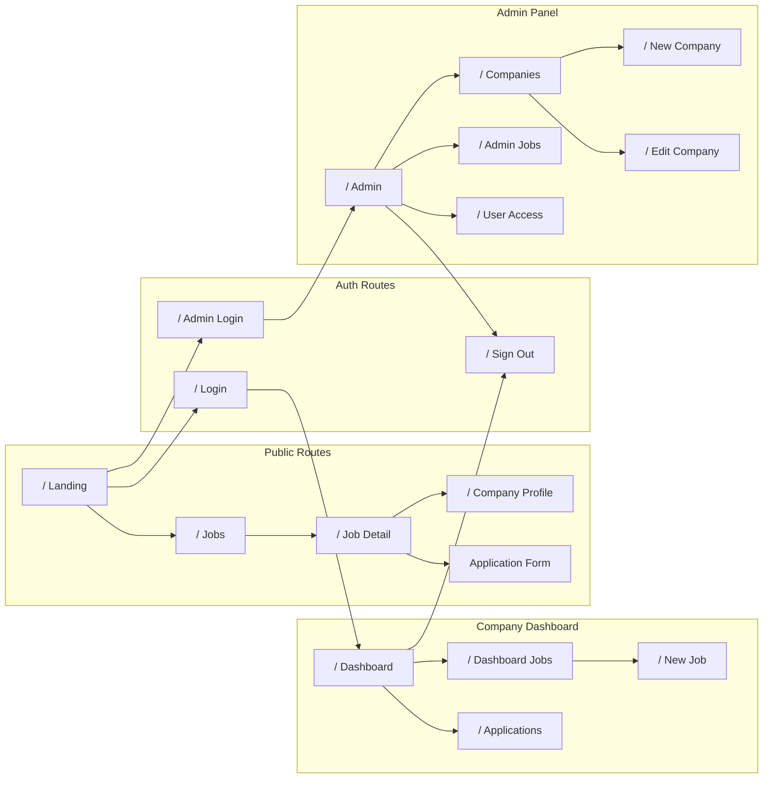

# Prospera Job Portal — MVP Progress Report

**Date:** March 3, 2026
**Status:** MVP Complete — End-to-End Verified
**Deployment Target:** Vercel

---

## 1. Executive Summary

The Prospera Job Portal is a **multi-company job board** that enables companies to publish and manage job postings while providing the public with a bilingual (Spanish/English) interface to discover opportunities. Administrators moderate companies, jobs, and user access.

The **MVP is feature-complete** and has been verified end-to-end: company signup through admin, login, job creation, publishing, public listing, in-app application submission, and admin moderation all function correctly.

### Key Metrics

| Metric | Count |
|--------|-------|
| Source files (`src/`) | 88 |
| React components | 46 |
| Pages (routes) | 17 |
| Layouts | 5 |
| Server actions | 18 |
| Database tables | 4 |
| Database enums | 4 |
| Indexes | 6 |
| Storage buckets | 2 |
| Migrations | 10 |
| i18n namespaces | 16 |
| i18n keys per locale | 267 |
| Locales | 2 (es, en) |

### E2E Verified Flow

> Admin creates company and user &rarr; User logs in &rarr; Creates job draft &rarr; Publishes job &rarr; Public user browses listings &rarr; Applies with resume &rarr; Company views applications &rarr; Admin moderates &rarr; Logout &rarr; Protected routes redirect correctly

---

## 2. Technology Stack

| Category | Technology | Version |
|----------|-----------|---------|
| Framework | Next.js (App Router) | 16.1.6 |
| Language | TypeScript | 5.x |
| Runtime | React | 19.2.3 |
| Styling | Tailwind CSS | 4.x |
| Backend/DB | Supabase (PostgreSQL + Auth + Storage) | JS SDK 2.97.0 |
| i18n | next-intl | 4.8.3 |
| Rich Text Editor | TipTap | 3.20.0 |
| Forms | React Hook Form + Zod | 7.71.1 / 4.3.6 |
| UI Primitives | Radix UI | 1.4.3 |
| Icons | Lucide React | 0.575.0 |
| Component Library | shadcn/ui | 3.8.5 |
| Deployment | Vercel | — |

---

## 3. System Architecture



---

## 4. Project Structure

```
prospera-job-portal/
├── public/                          # Static assets (repo root)
├── proxy.ts                         # Next.js 16 middleware (auth + i18n)
├── next.config.ts                   # Next.js config + next-intl plugin
├── src/
│   ├── app/
│   │   ├── layout.tsx               # Root layout (minimal)
│   │   ├── page.tsx                 # Root redirect
│   │   ├── globals.css              # Global styles (Tailwind v4)
│   │   └── [locale]/
│   │       ├── layout.tsx           # Locale layout (next-intl provider)
│   │       ├── page.tsx             # Landing page
│   │       ├── login/               # Company login
│   │       ├── admin/login/         # Admin login
│   │       ├── auth/                # Confirm + signout routes
│   │       ├── (public)/            # Public pages (Header/Footer layout)
│   │       │   ├── jobs/            # /jobs, /jobs/[id]
│   │       │   └── companies/       # /companies/[slug]
│   │       ├── (dashboard)/         # Protected (company/admin)
│   │       │   └── dashboard/       # /dashboard, /dashboard/jobs, etc.
│   │       └── (admin)/             # Protected (admin only)
│   │           └── admin/           # /admin, /admin/companies, etc.
│   ├── components/
│   │   ├── ui/          (24)       # Design system (shadcn/ui + custom)
│   │   ├── layout/      (10)       # Header, Footer, Sidebars, TopBars
│   │   ├── jobs/         (6)       # JobCard, JobForm, Filters, Apply
│   │   ├── admin/        (5)       # Admin-specific action components
│   │   └── auth/         (1)       # LoginForm (company/admin variant)
│   ├── lib/
│   │   ├── supabase/               # server.ts, client.ts, middleware.ts, admin.ts
│   │   ├── utils.ts                # Utility functions
│   │   ├── locale.ts               # Locale helpers
│   │   └── countries.ts            # Country data
│   ├── types/
│   │   └── database.types.ts       # Auto-generated Supabase types
│   ├── i18n/
│   │   ├── routing.ts              # Locale config (es default, en)
│   │   ├── request.ts              # Server message loading
│   │   └── navigation.ts           # Locale-aware Link, redirect, etc.
│   └── messages/
│       ├── es.json                  # Spanish (267 keys)
│       └── en.json                  # English (267 keys)
└── docs/                            # Documentation
```

---

## 5. Database Schema

### Enums

| Enum | Values | Usage |
|------|--------|-------|
| `user_role` | `user`, `company`, `admin` | `profiles.role` |
| `employment_type` | `full_time`, `part_time`, `contract` | `jobs.employment_type` |
| `job_status` | `draft`, `published`, `archived` | `jobs.status` |
| `work_mode` | `on_site`, `remote`, `hybrid` | `jobs.work_mode` |

### Tables

#### profiles

| Column | Type | Nullable | Default | Notes |
|--------|------|----------|---------|-------|
| `id` | `uuid` | NO | — | PK, FK &rarr; `auth.users` ON DELETE CASCADE |
| `role` | `user_role` | NO | `'user'` | |
| `company_id` | `uuid` | YES | NULL | FK &rarr; `companies(id)` ON DELETE SET NULL |
| `full_name` | `text` | YES | NULL | From auth metadata |
| `email` | `text` | YES | NULL | From auth.users |
| `avatar_url` | `text` | YES | NULL | |
| `created_at` | `timestamptz` | NO | auto | |
| `updated_at` | `timestamptz` | NO | auto | Trigger: `set_updated_at()` |

#### companies

| Column | Type | Nullable | Default | Notes |
|--------|------|----------|---------|-------|
| `id` | `uuid` | NO | `gen_random_uuid()` | PK |
| `name` | `text` | NO | — | Min 2 chars |
| `slug` | `text` | NO | — | UNIQUE, lowercase-hyphen |
| `logo_url` | `text` | YES | NULL | From `company-logos` bucket |
| `website` | `text` | YES | NULL | |
| `description` | `text` | YES | NULL | |
| `is_active` | `boolean` | NO | `true` | Admin toggle |
| `created_at` | `timestamptz` | NO | auto | |
| `updated_at` | `timestamptz` | NO | auto | Trigger: `set_updated_at()` |

#### jobs

| Column | Type | Nullable | Default | Notes |
|--------|------|----------|---------|-------|
| `id` | `uuid` | NO | `gen_random_uuid()` | PK |
| `company_id` | `uuid` | NO | — | FK &rarr; `companies(id)` ON DELETE CASCADE |
| `title` | `text` | NO | — | Min 3 chars |
| `description` | `text` | NO | — | Min 10 chars, rich text |
| `location` | `text` | YES | NULL | |
| `employment_type` | `employment_type` | NO | `'full_time'` | |
| `work_mode` | `work_mode` | NO | `'on_site'` | |
| `status` | `job_status` | NO | `'draft'` | |
| `apply_url` | `text` | YES | NULL | External URL (optional) |
| `published_at` | `timestamptz` | YES | NULL | Set on publish |
| `created_at` | `timestamptz` | NO | auto | |
| `updated_at` | `timestamptz` | NO | auto | Trigger: `set_updated_at()` |

#### applications

| Column | Type | Nullable | Default | Notes |
|--------|------|----------|---------|-------|
| `id` | `uuid` | NO | — | PK, client-generated |
| `job_id` | `uuid` | NO | — | FK &rarr; `jobs(id)` ON DELETE CASCADE |
| `full_name` | `text` | NO | — | Min 2 chars |
| `email` | `text` | NO | — | |
| `phone_country_code` | `text` | NO | — | ISO 3166-1 code |
| `phone_number` | `text` | NO | — | Min 6 chars |
| `country` | `text` | NO | — | |
| `linkedin_url` | `text` | YES | NULL | |
| `resume_path` | `text` | NO | — | Storage path |
| `cover_letter_path` | `text` | YES | NULL | Storage path |
| `created_at` | `timestamptz` | NO | `NOW()` | |

### Indexes

| Index | Table | Column(s) | Purpose |
|-------|-------|-----------|---------|
| `idx_jobs_status` | jobs | `status` | Filter by status |
| `idx_jobs_company_id` | jobs | `company_id` | Company's jobs lookup |
| `idx_jobs_published_at` | jobs | `published_at DESC NULLS LAST` | Sort by recency |
| `idx_jobs_location` | jobs | `location` | Filter by location |
| `idx_jobs_status_published_at` | jobs | `(status, published_at DESC)` | Composite: public listing |
| `idx_profiles_company_id` | profiles | `company_id` | Company users lookup |

### Helper Functions

| Function | Returns | Purpose |
|----------|---------|---------|
| `is_admin()` | `boolean` | Check if current user is admin (security definer) |
| `get_my_role()` | `user_role` | Get current user's role (security definer) |
| `get_my_company_id()` | `uuid` | Get current user's company_id (security definer) |
| `set_updated_at()` | trigger | Auto-set `updated_at` on UPDATE |
| `handle_new_user()` | trigger | Auto-create profile on signup |

### Storage Buckets

| Bucket | Public | Read | Write | Types | Max Size |
|--------|--------|------|-------|-------|----------|
| `application-documents` | No | Admin + job company | Anyone (form) | PDF | 5 MB |
| `company-logos` | Yes | Anyone | Admin only | PNG, JPG, SVG | 2 MB |

### Migration History (10 migrations)

1. `create_enums_and_helpers` — Enums + trigger functions + security definer helpers
2. `create_tables` — All 4 tables + indexes + triggers
3. `create_rls_policies` — RLS enabled + all policies
4. `fix_set_updated_at_search_path` — Security fix for search_path
5. `create_applications_table` — Applications table
6. `create_applications_storage_bucket` — Application documents bucket
7. `fix_applications_storage_rls_policy` — Fix storage RLS
8. `add_work_mode_to_jobs` — work_mode enum + column
9. `add_email_to_profiles` — Email column, backfilled from auth.users
10. `create_company_logos_bucket` — Company logos public bucket

### Entity Relationship Diagram



---

## 6. Authentication & Authorization

### Three-Layer Protection

| Layer | Mechanism | Scope |
|-------|-----------|-------|
| 1. Middleware | `proxy.ts` — redirects unauthenticated users | Route-level |
| 2. Layout guards | `layout.tsx` — verifies role before rendering | Group-level |
| 3. Row Level Security | Supabase RLS policies | Data-level |

### Login Flows

- **Company login** (`/login`): Accepts `company` and `admin` roles &rarr; redirects to `/dashboard`
- **Admin login** (`/admin/login`): Accepts only `admin` role &rarr; redirects to `/admin`
- **Sign-out** (`POST /auth/signout`): Clears session, redirects to home
- **Email confirmation** (`GET /auth/confirm`): Verifies OTP token

### Authentication Sequence



---

## 7. Job Lifecycle



| Transition | Who | What Happens |
|-----------|-----|-------------|
| Create &rarr; Draft | Company | Job inserted with `status = 'draft'` |
| Draft &rarr; Published | Company / Admin | `status = 'published'`, `published_at = NOW()` |
| Published &rarr; Archived | Company / Admin | `status = 'archived'`, removed from public listing |
| Any &rarr; Deleted | Company (own drafts) / Admin (any) | Row deleted, cascades to applications |

---

## 8. Application Submission Flow



### File Storage Convention

```
application-documents/
  └── {job_id}/
      └── {application_id}/
          ├── resume.pdf          (required, max 5 MB)
          └── cover_letter.pdf    (optional, max 5 MB)
```

---

## 9. Feature Inventory

### Public Features (no authentication required)

| # | Feature | Route | Description |
|---|---------|-------|-------------|
| 1 | Landing page | `/` | Hero section with featured jobs |
| 2 | Job listings | `/jobs` | Paginated list with search + filters |
| 3 | Text search | `/jobs` | Search by job title |
| 4 | Filters | `/jobs` | Location, employment type, work mode |
| 5 | Job detail | `/jobs/[id]` | Full description + company info |
| 6 | In-app application | `/jobs/[id]` | Form with resume/cover letter upload |
| 7 | Company profiles | `/companies/[slug]` | Company info + active job listings |
| 8 | Language switch | All pages | Toggle between Spanish and English |

### Company Dashboard Features (role: company or admin)

| # | Feature | Route | Description |
|---|---------|-------|-------------|
| 1 | Company login | `/login` | Email + password authentication |
| 2 | Dashboard overview | `/dashboard` | Job stats (total, published, drafts) |
| 3 | Job management | `/dashboard/jobs` | List all company jobs with status |
| 4 | Create job | `/dashboard/jobs/new` | Rich text form with TipTap editor |
| 5 | Publish / archive / delete | `/dashboard/jobs` | Status transition actions |
| 6 | View applications | `/dashboard/applications` | Received applications with file download |

### Admin Features (role: admin)

| # | Feature | Route | Description |
|---|---------|-------|-------------|
| 1 | Admin login | `/admin/login` | Separate admin authentication |
| 2 | Overview stats | `/admin` | Companies, jobs, users counts |
| 3 | Company management | `/admin/companies` | Full CRUD with logo upload |
| 4 | Create company | `/admin/companies/new` | Name, slug, logo, website, description |
| 5 | Edit company | `/admin/companies/[id]/edit` | Update details + toggle active status |
| 6 | Job moderation | `/admin/jobs` | View/publish/archive/delete any job |
| 7 | User management | `/admin/access` | View users, change roles, assign companies |
| 8 | User creation | `/admin/access` | Create users with role + company assignment |

---

## 10. Route Map

### All Routes (17 pages + 2 API routes)

| URL Pattern | Access | Layout Group | Description |
|------------|--------|-------------|-------------|
| `/` | Public | — | Root redirect |
| `/{locale}` | Public | — | Landing page |
| `/{locale}/jobs` | Public | (public) | Job listings |
| `/{locale}/jobs/[id]` | Public | (public) | Job detail + apply |
| `/{locale}/companies/[slug]` | Public | (public) | Company profile |
| `/{locale}/login` | Public | — | Company login |
| `/{locale}/admin/login` | Public | — | Admin login |
| `/{locale}/auth/confirm` | Public | — | Email confirmation (API) |
| `/{locale}/auth/signout` | Authenticated | — | Sign out (API) |
| `/{locale}/dashboard` | Company/Admin | (dashboard) | Dashboard overview |
| `/{locale}/dashboard/jobs` | Company/Admin | (dashboard) | Job management |
| `/{locale}/dashboard/jobs/new` | Company/Admin | (dashboard) | Create job |
| `/{locale}/dashboard/applications` | Company/Admin | (dashboard) | View applications |
| `/{locale}/admin` | Admin | (admin) | Admin overview |
| `/{locale}/admin/companies` | Admin | (admin) | Company list |
| `/{locale}/admin/companies/new` | Admin | (admin) | Create company |
| `/{locale}/admin/companies/[id]/edit` | Admin | (admin) | Edit company |
| `/{locale}/admin/jobs` | Admin | (admin) | Job moderation |
| `/{locale}/admin/access` | Admin | (admin) | User management |

### Navigation Flow



---

## 11. Security — Row Level Security (RLS)

### Policy Matrix

#### profiles

| Operation | Anonymous | Company User | Admin |
|-----------|-----------|-------------|-------|
| SELECT | All profiles | All profiles | All profiles |
| INSERT | — (trigger only) | — (trigger only) | — (trigger only) |
| UPDATE | — | Own row only (cannot change role) | Any |
| DELETE | — | — | Any |

#### companies

| Operation | Anonymous | Company User | Admin |
|-----------|-----------|-------------|-------|
| SELECT | Active only (`is_active = true`) | Active + own company | All |
| INSERT | — | — | Yes |
| UPDATE | — | Own company only | Any |
| DELETE | — | — | Any |

#### jobs

| Operation | Anonymous | Company User | Admin |
|-----------|-----------|-------------|-------|
| SELECT | Published + active company | Published + own company's drafts | All |
| INSERT | — | Own company only | Any |
| UPDATE | — | Own company only | Any |
| DELETE | — | Own company (drafts) | Any |

#### applications

| Operation | Anonymous | Company User | Admin |
|-----------|-----------|-------------|-------|
| SELECT | — | Own company's job applications | All |
| INSERT | Yes (via form) | Yes (via form) | Yes |
| UPDATE | — | — | — |
| DELETE | — | — | Admin |

### Storage Bucket Policies

| Bucket | Read | Write | Delete |
|--------|------|-------|--------|
| `application-documents` | Admin + job's company owner | Anyone (form submission) | Admin |
| `company-logos` | Anyone (public) | Admin | Admin |

### Security Definer Functions

RLS policies use `SECURITY DEFINER` helper functions to avoid recursion when querying `profiles`:

```sql
-- Called as: (select public.is_admin())
CREATE FUNCTION is_admin() RETURNS boolean
  SECURITY DEFINER SET search_path = public
  AS $$ SELECT role = 'admin' FROM profiles WHERE id = auth.uid() $$;

-- Called as: (select public.get_my_company_id())
CREATE FUNCTION get_my_company_id() RETURNS uuid
  SECURITY DEFINER SET search_path = public
  AS $$ SELECT company_id FROM profiles WHERE id = auth.uid() $$;
```

The `(select ...)` wrapper in RLS policies triggers PostgreSQL's `initPlan` optimization, evaluating the function once per query instead of once per row.

---

## 12. Internationalization (i18n)

### Configuration

| Setting | Value |
|---------|-------|
| Library | next-intl 4.8.3 |
| Locales | `es` (default), `en` |
| URL strategy | Always show locale prefix (`/es/jobs`, `/en/jobs`) |
| Message format | ICU MessageFormat (plurals, interpolation) |
| Parity | 100% — both locales have identical key sets |

### Namespace Breakdown

| Namespace | Keys | Scope |
|-----------|------|-------|
| `common` | 28 | Shared UI labels (buttons, nav, status) |
| `landing` | 4 | Landing page hero + CTA |
| `jobs` | 19 | Job listing page (search, filters, types) |
| `jobDetail` | 6 | Job detail page labels |
| `companies` | 8 | Company profile page |
| `login` | 7 | Login form |
| `dashboard` | 8 | Dashboard overview |
| `dashboardJobs` | 11 | Dashboard job management |
| `jobForm` | 8 | Job creation form |
| `jobCard` | 4 | Job card relative dates |
| `admin` | 4 | Admin layout labels |
| `adminOverview` | 5 | Admin overview stats |
| `adminCompanies` | 31 | Admin company management |
| `adminJobs` | 10 | Admin job moderation |
| `adminAccess` | 26 | Admin user/role management |
| `applicationForm` | 19 | Public application form |
| `dashboardApplications` | 10 | Company application viewer |
| **Total** | **267** | **per locale** |

---

## 13. Server Actions Inventory

| # | File | Function | Role | Description |
|---|------|----------|------|-------------|
| 1 | `login/actions.ts` | `login()` | company/admin | Sign in for company dashboard |
| 2 | `admin/login/actions.ts` | `adminLogin()` | admin | Sign in for admin panel |
| 3 | `dashboard/jobs/actions.ts` | `createJob()` | company/admin | Create draft job |
| 4 | `dashboard/jobs/actions.ts` | `publishJob()` | company/admin | Publish draft &rarr; published |
| 5 | `dashboard/jobs/actions.ts` | `archiveJob()` | company/admin | Archive published job |
| 6 | `dashboard/jobs/actions.ts` | `deleteJob()` | company/admin | Delete job |
| 7 | `jobs/[id]/actions.ts` | `submitApplication()` | public | Submit job application with files |
| 8 | `admin/access/actions.ts` | `createUser()` | admin | Create user (service role) |
| 9 | `admin/access/actions.ts` | `changeUserRole()` | admin | Change user's role |
| 10 | `admin/access/actions.ts` | `assignUserCompany()` | admin | Assign user to company |
| 11 | `admin/access/actions.ts` | `removeUserCompany()` | admin | Remove company from user |
| 12 | `admin/companies/actions.ts` | `createCompany()` | admin | Create company + logo upload |
| 13 | `admin/companies/actions.ts` | `updateCompany()` | admin | Update company + logo |
| 14 | `admin/companies/actions.ts` | `toggleCompanyActive()` | admin | Toggle active/inactive |
| 15 | `admin/companies/actions.ts` | `deleteCompany()` | admin | Delete company + cleanup |
| 16 | `admin/jobs/actions.ts` | `adminPublishJob()` | admin | Publish any job |
| 17 | `admin/jobs/actions.ts` | `adminArchiveJob()` | admin | Archive any job |
| 18 | `admin/jobs/actions.ts` | `adminDeleteJob()` | admin | Delete any job |

---

## 14. Metrics Summary

| Category | Metric | Count |
|----------|--------|-------|
| **Codebase** | Source files (`.ts` + `.tsx`) | 88 |
| | React components | 46 |
| | Pages | 17 |
| | Layouts | 5 |
| | Server action files | 7 |
| | Server action functions | 18 |
| | Library/helper files | 7 |
| **Database** | Tables | 4 |
| | Enums | 4 |
| | Indexes | 6 |
| | Security definer functions | 3 |
| | Trigger functions | 2 |
| | Storage buckets | 2 |
| | Migrations | 10 |
| **i18n** | Locales | 2 |
| | Namespaces | 16 |
| | Keys per locale | 267 |
| | Locale parity | 100% |
| **UI** | UI primitives (shadcn/ui) | 24 |
| | Layout components | 10 |
| | Job components | 6 |
| | Admin components | 5 |
| | Auth components | 1 |

---

## 15. Post-MVP Roadmap

### Performance Optimizations (deferred — post-launch)

| # | Optimization | Impact |
|---|-------------|--------|
| 1 | Memoize user + role lookup | Eliminate duplicate profile queries between layout and page |
| 2 | Add trigram index (`pg_trgm`) on `jobs.title` | Faster `ILIKE '%query%'` text search |
| 3 | Use `unstable_cache` for company data | Reduce DB calls for infrequently changing data |
| 4 | Store `user_role` in JWT claims | Eliminate profile query on every authenticated page |

### V2 Feature Candidates

| # | Feature | Description |
|---|---------|-------------|
| 1 | Self-service company registration | Companies sign up without admin intervention |
| 2 | Internal ATS / application tracking | Replace external apply URL with built-in workflow |
| 3 | Automatic job expiration | Jobs auto-archive after configurable TTL |
| 4 | Email notifications | Notify companies of new applications, job status changes |
| 5 | Advanced search | Full-text search with filters, facets, and sorting |
| 6 | Analytics dashboard | Job view counts, application rates, conversion metrics |
| 7 | Bilingual job content | Jobs with both Spanish and English descriptions |
| 8 | Candidate profiles | Saved profiles for repeat applicants |
| 9 | Social login | Google / Microsoft OAuth for company users |
| 10 | API syndication | Public API for job data to feed external boards |

---

*Generated: March 3, 2026*
